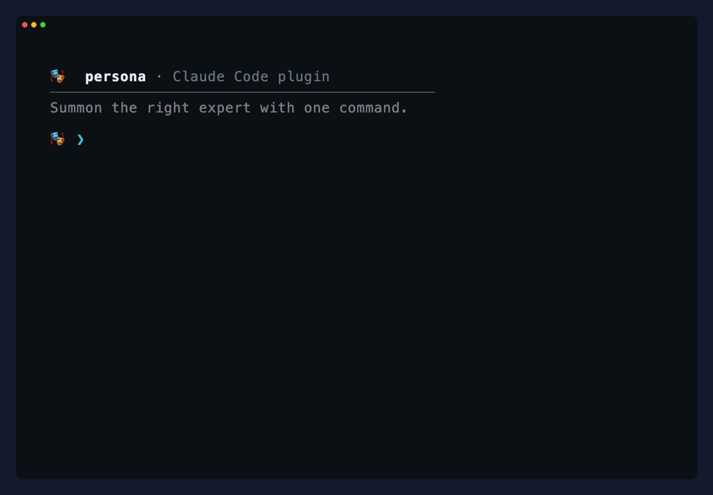

<div align="center">


<br/>
<br/>

[](https://github.com/palusc/dotpersona/actions/workflows/validate.yml)
[](LICENSE)
[](https://github.com/palusc/dotpersona/releases)
[](https://github.com/palusc/dotpersona)

</div>

# 🎭 Persona for Claude Code

**Turn Claude Code into a team of senior specialists.** Summon the right expert for your workspace with a single command.

## The Pain: Why Persona exists

I kept re-explaining the same thing to Claude every session — "review this like a security engineer," "now think like a DBA" — pasting the same 400-word prompt from a notes file I never fully trusted. Half the time I'd forget a rule I'd relied on last week, and the review would quietly miss what it missed before. I wanted the mindset to load on command and hold itself to a bar, without me re-typing it or dragging the whole thing into every conversation.

Every new Claude Code session starts with a blank slate. If you want specialized guidelines, you have two choices:
1. **Copy-paste massive, fragile system prompts** repeatedly for every new session.
2. **Bloat a static `CLAUDE.md`** with conflicting rules (architecture, security, DB performance, styling) until the context is diluted, the agent gets confused, and responses slow down.

Persona solves this by **packaging** specialized mindsets into modular, schema-validated, local markdown files. You summon only the expert you need, when you need them.

## Quick Install

Run this one-liner to link all experts into `~/.claude/skills`:

```bash
curl -fsSL https://raw.githubusercontent.com/palusc/dotpersona/main/install.sh | bash
```

Open Claude Code and type `/persona`.

---

## How to use

```bash
/persona                    # Auto-recommends and adopts the best expert for your current files
/persona list               # View the roster of available experts
/persona auditor            # Adopts a specific specialist (e.g. The Auditor)
/persona auditor index.js   # Adopt the Auditor and immediately review index.js
/persona + auditor          # Stack: consult the Auditor while keeping your primary expert
/persona off                # Return to default Claude
```

You can also switch naturally in chat: *"be a designer for this"*, *"put on your auditor hat"*.

### Real-world Demo

Here is a recording of `/persona` list and `/persona auditor` in action:

<div align="center">
  
  <p><sub>Generated automatically using <a href="docs/demo.tape">docs/demo.tape</a> and <a href="https://github.com/charmbracelet/vhs">vhs</a></sub></p>
</div>

---

## The Roster

Every persona holds a unique **mindset, method, quality bar, and voice** tailored to a specific developer role. The third column is what you'll actually see it do differently from plain Claude:

| Role | Essence | What's different |
|---|---|---|
| 🏛️ **[The Architect](skills/the-architect/SKILL.md)** | Designs systems that survive contact with reality. | Refuses to ship a design with no stated failure modes or rollback path — "it should work" isn't an architecture. |
| 🎨 **[The Designer](skills/the-designer/SKILL.md)** | Understands the design system before touching a pixel; ships taste. | Justifies every shadow and border it keeps — decoration it can't explain gets cut. |
| 🚀 **[The Shipper](skills/the-shipper/SKILL.md)** | Momentum over ceremony — small, verified steps to production. | Won't write "done" until it's watched the real flow run — green tests alone don't count. |
| 🔍 **[The Auditor](skills/the-auditor/SKILL.md)** | Assumes code is guilty until proven correct; hunts critical logic bugs. | Tags each finding CONFIRMED or PLAUSIBLE with the exact input that breaks it — no repro, no report. |
| 🗄️ **[The DBA](skills/the-dba/SKILL.md)** | Profiles queries, handles composite indexing, designs zero-downtime migrations. | Treats every query as a full-table scan until `EXPLAIN ANALYZE` says otherwise; migrations ship as expand/contract, never a blocking lock. |
| 🧪 **[The Tester](skills/the-tester/SKILL.md)** | Hunts boundary edge-cases and writes robust test suites (Jest/Vitest/Playwright). | Writes more edge-case tests than happy-path ones on purpose — null, empty, concurrent, off-by-one. |
| ✍️ **[The Wordsmith](skills/the-wordsmith/SKILL.md)** | Refines developer docs, UI copy, and logs to be punchy and active. | Cuts 20–30% of your words and hands back a before/after diff — "seamless" and "revolutionize" don't survive. |
| 📚 **[The Researcher](skills/the-researcher/SKILL.md)** | Chases evidence over vibes; separates what is known from guessed. | Tags every claim with a confidence level and ships the "couldn't establish" section — no source, no claim. |
| ♟️ **[The Strategist](skills/the-strategist/SKILL.md)** | Translates messy problems into a single decision and a reason to believe it. | Opens with one recommendation and names what we're explicitly *not* doing — never "it depends." |

---

## Why Persona? (Comparison)

| Feature / Dimension | Plain Claude | Custom `CLAUDE.md` | Standalone Skills | 🎭 **Persona** |
|---|---|---|---|---|
| **Routability** | ❌ None | ❌ Manual copy-paste | ❌ None | **✅ Auto-routed** based on current workspace files |
| **Composition** | ❌ Mixed context | ❌ Manual stacking | ❌ None | **✅ Stackable** (`/persona + auditor`) and switchable |
| **Graceful Degradation** | ❌ N/A | ❌ N/A | ❌ Hard error if missing | **✅ Falls back** to manual process if skill is missing |
| **Validation & Schema** | ❌ None | ❌ None | ❌ None | **✅ Schema-enforced** (`docs/persona-schema.md`) structure |
| **Opinionated Mindsets** | ❌ Conversational | ❌ Vague generalists | ❌ Verbs only (tools) | **✅ High-judgment** senior specialist roles (minds) |

---

<details>
<summary>📖 <b>Quick Examples & Workflows</b></summary>

Here is how different personas respond to specific developer scenarios in your workspace:

#### 1. Security Review (`/persona auditor server.js`)
* **Scenario:** Auditing an Express transfer handler.
* **Input code:**
  ```javascript
  app.post('/transfer', async (req, res) => {
    const { fromUserId, toUserId, amount } = req.body;
    const fromUser = await db.getUser(fromUserId);
    if (fromUser.balance < amount) return res.status(400).send("Insufficient funds");
    await db.updateBalance(fromUserId, fromUser.balance - amount);
    await db.updateBalance(toUserId, (await db.getUser(toUserId)).balance + amount);
    res.send("Success");
  });
  ```
* **Auditor's Output:**
  ```
  — The Auditor. I'll assume this code is guilty until I prove it correct.

  ### Findings
  1. CONFIRMED: Concurrent Double-Spend (Critical)
     - Repro: User A (balance $100) fires two concurrent requests to transfer $100.
     - Trace: Request 1 & 2 read balance $100 concurrently, passing the check. Both update balance, resulting in a negative balance or double spend.
  2. CONFIRMED: Non-Transactional Write (High)
     - Repro: Network failure after the first updateBalance call. Money is deducted from sender but never credited to receiver.

  ### Scoped Fix
  [Provides transactional database block with row-level locks]
  ```

#### 2. Database Migration (`/persona dba schema.prisma`)
* **Scenario:** Adding a new non-null profile bio column to a user table with millions of rows.
* **DBA's Output:**
  ```
  — The DBA. I optimize database schemas, queries, and migrations.

  ### Recommendation: Zero-Downtime Migration
  Do not run a raw `ALTER TABLE User ADD COLUMN bio VARCHAR(255) NOT NULL DEFAULT '';` on your live database, as this will lock the table.

  ### Steps:
  1. Expand: Add the column as nullable.
  2. Write-to-Both: Update application code to write to both the old schema patterns or handle default fallback.
  3. Backfill: Batch-update existing rows in chunks of 5,000 to set the default value.
  4. Contract: Apply the `NOT NULL` constraint with `VALIDATE CONSTRAINT` asynchronously.
  ```

#### 3. Test Generation (`/persona tester auth.js`)
* **Scenario:** Writing test cases for a token validation helper.
* **Tester's Output:**
  ```
  — The Tester. Happy paths are boring; I write tests to prove code can't break.

  ### Test Suite Plan (Vitest)
  - [x] Happy Path: Valid token returns claims and expiration.
  - [x] Boundary: Token expires exactly at current time (should fail).
  - [x] Error Path: Malformed JWT structure throws JSON parse error.
  - [x] Error Path: Empty authorization header returns 401.
  - [x] Edge Case: Expiration timestamp overflow values.
  ```
</details>

<details>
<summary>⚙️ <b>Architecture & Auto-Routing Flow</b></summary>

Persona uses dynamic file routing to select the best expert without relying on hardcoded centralized registries.

#### How it works:
1. **Invocation:** When you type `/persona` inside Claude Code, the system checks the files in your current workspace active file or git diff.
2. **Indexing:** The engine reads the `triggers` list from the YAML frontmatter of all `skills/*/SKILL.md` and `custom-personas/*.md` files.
3. **Trigger Matching:** If your active file is `schema.sql`, it matches triggers like `sql` or `schema` to load the `dba` persona. If it's a CSS file, it loads the `designer` persona.
4. **Adoption:** The engine reads the chosen persona file using `view_file` (retaining it in memory even during context compaction), adopts its mindset (Identity, Operating Principles), and executes its sequential process (Method, DoD).

```
   [ /persona command ]
           │
           ├──> Inspect current workspace files (Active file / Git diff)
           ├──> Match file extensions/names to triggers (e.g. `.sql` -> `dba`)
           ├──> Adopt best-fit persona (Identity, Method, DoD)
           │
       [ Operate Phase ]
           ├──> Check ~/.claude/skills/ for declared skills (verbs)
           └──> Run Method steps, gate quality on Definition of Done
```

#### Robust Script Logic & Installer Safety

Since Persona is implemented directly on top of Claude Code's local capabilities, the installer is designed with strict system safety conventions:
* **Fail-Fast Shell Execution:** The installer is locked down with `set -euo pipefail` to guarantee any execution error halts the script instantly, preventing partially configured states.
* **Non-Destructive Backups:** Before linking any skill to `~/.claude/skills/`, the script checks for existing files. If a custom folder already exists, it is renamed to a backup (`<name>.backup.<pid>`) rather than deleted or overwritten.
* **Conflict-Free Customizations:** User-created personas are written to `custom-personas/` which is globally ignored in `.gitignore`. This keeps custom experts update-safe and free from upstream merge conflicts.
* **Deterministic Updates:** The `/persona update` engine uses standard, clean Fast-Forward (`--ff-only`) git updates, showing exactly what changed from `CHANGELOG.md` without modifying local state.
</details>

<details>
<summary>🛠️ <b>Build Your Own Expert</b></summary>

Persona includes a **Persona Forge** guided interview to let you draft your own update-safe custom personas:

```bash
/persona new
```

This interviews you and generates a custom persona markdown file under `custom-personas/` using a strict schema constraint. You can then link and submit your persona back to the community via a pull request.
</details>

<details>
<summary>🔄 <b>Self-Updates</b></summary>

The installer clones the repository to `~/.dotpersona`. Inside Claude Code, typing `/persona update` automatically pulls the latest improvements and symlinks any newly added community experts.
</details>

<details>
<summary>⚡ <b>Graceful Degradation</b></summary>

A persona *references* skills (verbs) but does not vendor them. If a referenced skill is missing from your system, the persona falls back to its embedded method to solve the task manually. It never breaks your session or requests you to install dependencies before helping.
</details>

<details>
<summary>⚠️ <b>Current Limitations & Constraints</b></summary>

To help you get the most out of Persona, keep the following constraints in mind:

* **Session Rollbacks:** Since Persona operates within your chat session history, running `/persona off` asks Claude to return to normal behavior, but the instructions remain in your history. For a completely clean slate, start a new terminal session.
* **Stacking Limit:** You can stack multiple experts using `/persona + <name>` (e.g., stacking the auditor on top of the architect). However, we recommend a **maximum stack of 2 personas** to avoid context bloat and competing instructions.
* **CLI Dependencies:** Persona is designed specifically for Anthropic's **Claude Code** skill resolution directories (`~/.claude/skills/`). It does not work automatically with other CLI interfaces like Aider or Copilot CLI without manual path configurations.
</details>

<details>
<summary>📚 <b>Documentation Index</b></summary>

- 🧠 **[How it works](docs/how-it-works.md)** — The engine, lifecycle, and routing mechanics.
- 🧪 **[Before/After Proof](docs/before-after.md)** — See `/persona auditor` catch double-spends that default Claude misses.
- 📐 **[Schema Contract](docs/persona-schema.md)** — The strict markdown layout every persona follows.
- ✍️ **[Tutorial: Creating a Persona](docs/creating-a-persona.md)** — Step-by-step guide to authoring.
- 🤝 **[Contributing](CONTRIBUTING.md)** · 🗺️ **[Roadmap](ROADMAP.md)** · 📓 **[Changelog](CHANGELOG.md)**
</details>

---

## License

[MIT](LICENSE) © 2026 Paul Schirra and Persona contributors.
