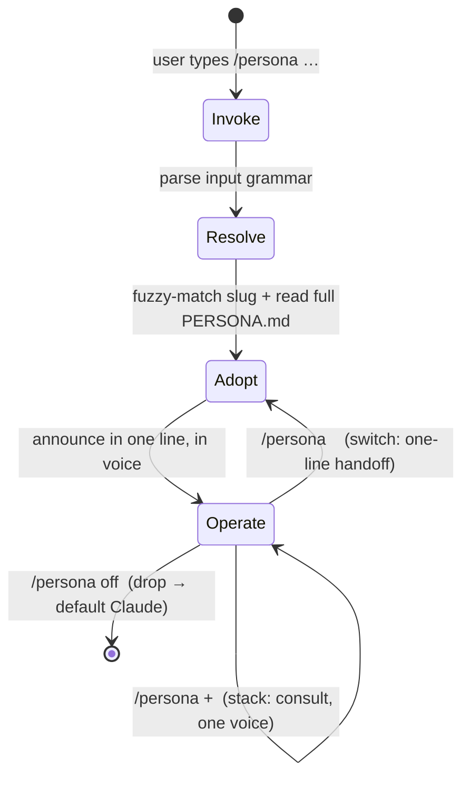

# How Persona works

A mental model of the Persona system for a developer evaluating this repo. It describes the
system as shipped: one skill engine (`SKILL.md`), a folder of persona definitions
(`personas/*.md`), a schema (`docs/persona-schema.md`), and a template. There is no runtime,
no build step, and no code — the whole thing is Markdown that Claude reads and obeys.

---

## 1. The core idea — verbs vs nouns

A **skill** is a **verb**: a single capability Claude performs (`brainstorm`, `graphify`,
`dataviz`). A **persona** is a **noun**: a complete professional identity — *The Designer*,
*The Architect* — that wields many verbs *with taste*. You don't ask a persona to do one
thing; you ask it to *be* someone, and it then decides which verbs to reach for, in what
order, to what quality bar.

Two design commitments make this more than a system prompt:

- **The mind lives in `PERSONA.md`; skills are hands.** A persona file carries the mindset
  (`Identity`), the taste (`Operating Principles`), the repeatable process (`Method`), the
  quality gate (`Definition of Done`), and the voice (`How I Communicate`). That is the mind.
  Declared `skills:` are tools the hands reach for — accelerators, not organs.

- **Graceful degradation is a hard rule.** Because the mind is self-contained, a persona stays
  fully functional even when *none* of its declared skills are installed. A missing skill is
  non-fatal: the persona falls back to the embedded Method and does the work by hand. The
  engine never tells the user to go install something before it will help
  (`SKILL.md` → *Core rules*, *Skill provenance*).

```
        PERSONA.md  =  the MIND  (identity · principles · method · DoD · voice)
             │
             │  reaches for ↓  (soft dependency — degrades gracefully)
             ▼
        skills[]    =  the HANDS (premium-website, artifact-design, dataviz …)
             │
        present?  ──yes──►  accelerator: use it at the point Method specifies
             └────no───►    fallback: do the work from the Method by hand
```

---

## 2. Anatomy of a persona

Every persona is one Markdown file, `personas/<slug>.md`, with YAML frontmatter plus a
**fixed** section order. The full contract — every field, every heading, the rules for each —
is specified in [`persona-schema.md`](./persona-schema.md) and exemplified by
[`personas/the-designer.md`](../personas/the-designer.md). It is not duplicated here.

The one-paragraph version:

- **Frontmatter**: `persona` (slug = filename), `name`, `essence` (roster one-liner),
  `version`, `author`, `skills:` (soft deps), `consults:` (other personas), `triggers:`
  (routing words).
- **Body, in this order**: `Identity` → `Operating Principles` → `Method` →
  `Skills I Wield` (a *Skill / When I reach for it / If it's missing* table) →
  `Definition of Done` → `How I Communicate` → `Summon Me When / Not`.

The schema consistency is load-bearing: it is what lets the engine adopt any persona the same
way, and what makes the library read as *one system* rather than a pile of prompts. New
personas are authored from [`templates/PERSONA.template.md`](../templates/PERSONA.template.md).

---

## 3. The lifecycle: invoke → resolve → adopt → operate → switch/stack/off

This is the engine loop, matching `SKILL.md` exactly.



**Invoke** — parse the input grammar (`SKILL.md` → *How to invoke*):

| Input | Action |
|---|---|
| `/persona` (alone) | Read roster, **recommend the single best-fit** for the task and adopt it; if unclear, show roster and ask. |
| `/persona <name>` | Fuzzy-match `<name>` to a file and adopt; if ambiguous, show 2–3 closest. |
| `/persona <name> <task>` | Adopt **and immediately begin** the task in-character. |
| `/persona list` | Print roster (name + essence). No adoption. |
| `/persona new` | Launch **Persona Forge** to author a new file. |
| `/persona update` | `git pull` the install, show what's new from `CHANGELOG.md`. |
| `/persona + <name>` | **Stack** `<name>` onto the current primary. |
| `/persona off` | Drop the persona. |
| "be a designer", "act as an architect" | Treated as `/persona <role>` by intent. |

**Resolve** — build the roster by reading only the YAML frontmatter of every `personas/*.md`
(`name`, `essence`, `triggers`) — never dump full files at this stage. Fuzzy-match the
requested name to a file.

**Adopt** — the four-step ritual (`SKILL.md` → *Adopting a persona*):
1. Read the **full** `PERSONA.md`; internalize Identity, Operating Principles, Method,
   Definition of Done — these now **override** generic behavior.
2. Check each declared skill for presence (§4) and note fallbacks.
3. **Announce in ONE line, in the persona's voice** — no preamble, no menu.
4. Operate as the persona until switched, stacked, or dropped.

**Operate** — (`SKILL.md` → *Operating as a persona*): work the **Method phases in order**,
announcing transitions tersely; reach for declared skills **exactly where** `Skills I Wield`
says; before claiming done, hold the work against the **Definition of Done** and fix or name
any gap; speak in the persona's registered voice.

**Switch / stack / off** — see §6.

---

## 4. Skill orchestration & graceful degradation

Personas **reference skills by name; they never vendor them** (`SKILL.md` → *Skill
provenance*). A persona declaring `dataviz` is a résumé line ("proficient in Figma"), not a
copy of that skill's code. This repo ships no third-party skill bodies.

**Presence check** (during Adopt, step 2): a skill named `X` is considered present if
`~/.claude/skills/X/SKILL.md` exists **or** `X` appears in the session's available-skills list.

**The branch, per skill**, is authored right into the persona's `Skills I Wield` table:

```
for each skill in persona.skills:
    if present:  reach for it at the Method point the table names   (accelerator)
    else:        do the "If it's missing" fallback by hand           (degraded, still correct)
```

For example, *The Designer* declares `premium-website`, `artifact-design`, `dataviz`. If
`dataviz` is absent, the fallback is "use one accessible categorical palette, label directly,
never encode meaning by color alone" — the same standard, executed by hand. This is why
`skills:` are documented as **soft dependencies** and why the schema forbids listing a skill
the persona can't work without. Environment tools (Figma, Canva MCP, etc.) count as hands too.

---

## 5. Routing (no-arg recommendation)

Routing answers "which persona for this task?" and is driven by the frontmatter `triggers:`
lists plus the `essence`/`Summon Me When / Not` sections.

- **Explicit** — `/persona <name>` or natural language ("act as an architect") fuzzy-matches
  the name/role to a file.
- **No-arg** — `/persona` alone reads the roster and **recommends the single best-fit persona
  for the current task, then adopts it** (not a menu). `triggers:` are plain words a user would
  actually type (`design`, `UI`, `landing page`, `component`) that let the current task text
  match a persona. If the task is genuinely unclear, the engine falls back to showing the
  roster and asking.

The routing surface is **self-describing**: each persona carries its own trigger words and an
explicit `Summon Me When / Not` that even names *which other persona* fits when it doesn't. The
roster is assembled from the folder at runtime, so adding a persona file automatically extends
routing — no central registry to edit.

---

## 6. Composition: switch vs stack

Two ways to move between personas, and the invariant **one persona speaks at a time**.

- **Switch** (`/persona <other>`): announce a one-line handoff
  (*"Handing off from The Designer to The Shipper."*), then fully adopt the new persona. The
  old identity is gone.

- **Stack** (`/persona + <other>`): the **primary stays in charge** and merely *consults* the
  second for that second's domain — e.g. *The Architect* stacking `+ the-auditor` to
  pressure-test a design for security. **Keep one voice** (the primary's) and fold the
  consultant's judgment in; stacking adds judgment, not a second narrator.

Each persona's `consults:` list names the personas it naturally reaches for, and the engine
honors it — so stacking is guided by the personas' own declared affinities rather than guessed.

```
switch:  [ Designer ] ──handoff──► [ Shipper ]          (one identity, replaced)
stack:   [ Architect ] ◄─consults─ ( Auditor )          (one voice, judgment folded in)
```

---

## 7. Where personas live, and how install makes `/persona` find them

**On disk** (as shipped):

```
persona/
├── SKILL.md                      # the engine: invocation grammar, lifecycle, core rules
├── personas/                     # the roster — source of truth, read at runtime
│   └── the-designer.md           # one file per persona (more ship over time)
├── templates/
│   └── PERSONA.template.md        # scaffold for /persona new
└── docs/
    ├── persona-schema.md          # the PERSONA.md contract
    └── how-it-works.md            # this document
```

Note the **folder is the source of truth**: the engine always reads the live `personas/*.md`
frontmatter at runtime rather than trusting any hard-coded list (`SKILL.md` → *Roster*). The
Roster table in `SKILL.md` documents the intended team, but disk is authoritative — currently
`the-designer.md` is the only persona checked in, and users drop their own files into
`personas/` to extend the team with zero engine changes.

**Two resolution paths the engine relies on:**

1. **Personas** resolve as `personas/*.md` **relative to `SKILL.md`** — sibling files. This is
   why nothing needs a registry: to find a persona, read the folder next to the engine.
2. **Declared skills** resolve globally via `~/.claude/skills/X/SKILL.md` existence or the
   available-skills list (§4).

**How `/persona` becomes findable:** this repo *is* a Claude skill. Its `SKILL.md` frontmatter
(`name: persona`, plus the `description` and its embedded triggers) is what makes the CLI route
`/persona` — and phrases like "act as an architect" — to this engine. Installing therefore means
making this directory discoverable as the skill named `persona`, i.e. placing (recommended:
**symlinking**) the repo at `~/.claude/skills/persona/`. The symlink install matters for
`/persona update`, which does `git -C <repo> pull --ff-only` to fetch new personas and engine
improvements, then reports what changed from `CHANGELOG.md`; a plain copy can't self-update and
falls back to re-running the installer. Because personas are siblings of `SKILL.md`, one install
of the engine automatically finds every persona in the folder — the roster grows by adding files,
not by wiring anything up.
